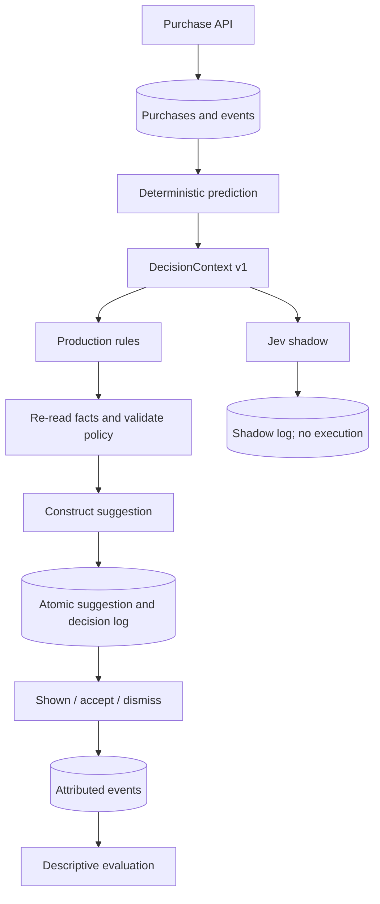

# Smart Replenishment MVP design

**Status: MVP implemented, 2026-09-22.**
The Go service lives in `backend/`; the React simulation frontend lives in `frontend/`.
This document preserves the architecture and acceptance criteria. See the root README
for setup, actual runtime limits, and verification commands. The Jev adapter is covered
by mock HTTP tests; a live call requires configured credentials.

One modular Go monolith, PostgreSQL, REST. The invariant is:

**Facts → Prediction → Decision → Policy → Action → Feedback.**

## Boundaries and proposed layout

| Package | Responsibility |
|---|---|
| backend/cmd/server, backend/cmd/seed | Wiring, configuration, reproducible demo |
| backend/internal/domain | User, Product, Purchase, PurchaseItem, UserEvent, membership, Suggestion |
| backend/internal/replenishment | Pure interval statistics, eligibility, confidence |
| backend/internal/decision | Compact versioned context, DecisionEngine interface, rules and Jev |
| backend/internal/policy | Validate enum, permissions, current membership, availability, cooldown |
| backend/internal/action | Construct bounded suggestions; never purchase or modify cart |
| backend/internal/app | Orchestrate evaluation, transactions, feedback, metrics |
| backend/internal/postgres | SQL and transaction implementation; no business decisions |
| backend/internal/httpapi | Decode and validate requests, map errors, encode responses |
| backend/migrations | Embedded, ordered SQL migrations with a migration ledger |

Go contracts: `DecisionEngine.Decide(context.Context, DecisionContext) (DecisionResult, error)`;
`Prediction` contains descriptive statistics and explainable confidence;
`PolicyEngine.Validate` produces an allowed action and reason;
`action.Build` constructs an inert suggestion from permitted items.
The app defines narrow storage interfaces implemented by PostgreSQL. No provider dependencies
leak into handlers, policy, prediction, or persistence.

### Proposed Go contracts

These are design signatures, not implementation files. Fields will have snake_case JSON tags.

```go
type User struct {
    ID                  string
    Timezone            string
    NotificationEnabled bool
    SuggestionEnabled   bool
    CreatedAt           time.Time
}

type Product struct {
    ID, SKU, Name, Category, Brand, Unit string
    ReplenishableScore                  float64
    Available                          bool
}

type Purchase struct {
    ID, UserID, Source string
    PurchasedAt       time.Time
    TotalAmount       int64 // minor units
    Items             []PurchaseItem
}

type PurchaseItem struct {
    ProductID string
    Quantity  int64
    UnitPrice int64 // minor units
}

type UserEvent struct {
    ID, UserID, EventType string
    ProductID            *string
    DecisionID           *string
    SuggestionID         *string
    Metadata             json.RawMessage
    CreatedAt            time.Time
}

type Prediction struct {
    ProductID             string
    Eligible              bool
    Reason                string
    TotalPurchaseCount    int // distinct purchase occasions
    LastPurchaseDate      time.Time
    DaysSinceLastPurchase float64
    MedianRepurchaseDays  float64
    MeanRepurchaseDays    float64
    IntervalVariance      float64
    PurchaseRegularity    float64
    AverageQuantity       float64
    EstimatedDaysRemaining *float64 // nil for ineligible products
    PredictionConfidence  float64
}

type DecisionContext struct {
    Version  string // v1
    AsOf     time.Time
    User     UserContext
    Product  ProductContext
    Shopping ShoppingContext
}

type UserContext struct {
    Timezone                  string
    SuggestionEnabled         bool
    NotificationEnabled       bool
    ShoppingFrequency         string // unknown until sufficient observations
    PreferredShoppingDay      *string
    SuggestionAcceptanceRate  *float64
    SuggestionDismissRate     *float64
    LastSuggestionHoursAgo    *float64
}

type ProductContext struct {
    Prediction
    Category                string
    Available               bool
    CurrentlyInCart         bool
    CurrentlyInShoppingList bool
    PendingSuggestion       bool
    LastSuggestionHoursAgo  *float64
}

type ShoppingContext struct {
    CartItemCount           int
    SmartListItemCount      int
    UserIsCurrentlyShopping bool // recent observed activity, not an AI inference
}

type Action string // six allowed values; checked at the boundary and by policy

type DecisionResult struct {
    Action         Action
    Confidence     float64
    Probability    *float64 // selected option probability; distinct from confidence
    Provider       string
    Model          string
    ContextVersion string
    Metadata       json.RawMessage // provider distribution and token usage
    LatencyMS      int64
    CostUSD        *float64 // nil when unavailable
}

type DecisionEngine interface {
    Decide(context.Context, DecisionContext) (DecisionResult, error)
}

type PolicyResult struct {
    Allowed          bool
    Action           Action
    Reason           string
    ExecutionContext DecisionContext // fresh facts used to authorize execution
}

type Suggestion struct {
    ID, UserID, Kind, Message, Section, Status string
    Items                                    []SuggestionItem
    CreatedAt                                time.Time
}

type SuggestionItem struct {
    ProductID, DecisionID string
}

type DecisionLog struct {
    ID, EvaluationID, UserID, ProductID, Engine string
    Shadow                                    bool
    Context                                   DecisionContext
    Result                                    *DecisionResult // nil on provider failure
    Policy                                    *PolicyResult
    ExecutedAction                            Action
    Error                                     *string
    CreatedAt                                 time.Time
}
```

`RuleBasedDecisionEngine` and `JevDecisionEngine` implement the same interface.
Prediction, context construction, policy, and suggestion construction remain pure functions
or concrete types; they do not need interfaces simply to mirror the module names.
The application owns a repository interface for loading facts and a transaction boundary
for saving logs, suggestions, memberships, and events atomically. PostgreSQL implements it.

## Schema

All IDs are UUIDs, timestamps are TIMESTAMPTZ, money is integer minor units in a single
application currency. Quantity is an integer count of SKU units (fractional/weight-based
units and currency conversion are deferred).

- users: id, timezone, notification_enabled, suggestion_enabled, created_at.
- products: id, unique sku, name, category, brand, unit, replenishable_score [0,1], available.
- purchases: id, user_id FK, purchased_at, source enum, total_amount >= 0.
- purchase_items: (purchase_id, product_id) PK/FKs, quantity > 0, unit_price >= 0.
- user_product_state: (user_id, product_id) PK/FKs, in_cart, in_list.
- decision_logs: id, evaluation_id, user/product FKs, engine, shadow, decision_context JSONB,
  decision_result JSONB, policy_result JSONB (includes refreshed execution context), executed_action,
  error, created_at. A shadow row always executes DO_NOTHING.
- suggestions: id, user FK, kind, message, section, status, created_at.
- suggestion_items: (suggestion_id, product_id) PK/FKs, decision_id FK. Bundles preserve
  per-product attribution.
- user_events: id, user/product/decision/suggestion FKs where applicable, event_type enum,
  metadata JSONB, created_at. Shown/accepted/dismissed events have deduplication indexes.

Indexes support purchase histories, user decision history, product cooldowns, and event
attribution. Purchase, items, membership changes, and purchase events commit atomically.
A user row lock serializes writes affecting policy and feedback. Production rules,
prediction, context building, policy and execution run within the same transaction, so
concurrent purchases or preference changes cannot invalidate the loaded user facts.
Shared product locks protect availability during execution. Provider calls run outside
transactions and are shadow-only. Transaction failures roll back both suggestions and their logs;
an HTTP failure must never report a suggestion that was not committed.
Production and shadow evaluate exactly the same immutable context, paired by evaluation_id
and product_id. Shadow failures are logged and do not prevent rule execution.

## Flow



## Prediction baseline

Group purchases on the same local calendar day into one purchase occasion. Require at
least three occasions and replenishable_score >= 0.5. Use median interval as the expected
repurchase period; report mean and population variance for diagnostics. Regularity is
`1 / (1 + mean(abs(interval - median)) / median)`. This penalizes anomalies while keeping
them out of the primary prediction. Confidence is
`min(1, interval_count / 4) * regularity * replenishable_score`. It is a heuristic,
not a calibrated probability. Remaining days = median interval - elapsed days; negative
means overdue. Quantities are reported, but not used to infer consumption without evidence.

## Execution and evaluation choices

Rules suggest when remaining days <= 2 and confidence >= 0.7; otherwise WAIT. All six enum
actions are supported by policy and executor; WAIT and DO_NOTHING have no suggestion.
Bundles combine only individually permitted bundle candidates; a singleton degrades to
SUGGEST_NOW with the final action recorded. Suggested-list entries are proposals, not
accepted list items. Accept explicitly adds linked products to the shopping list; never cart.
A pending suggestion blocks duplicates even after cooldown. GET suggestions does not imply
an impression; the client must POST shown. Accept/dismiss are idempotent; contradictory
feedback returns conflict.

Jev uses the documented TypeSafe HTTP Choice API with six criteria. No generated prose
is executed. Validate the returned enum, distribution, and confidence. Cost is null when
not supplied; token usage is retained. No live Jev requests run without explicit configuration.

Metrics report acceptance/dismissal among shown item suggestions, observed purchases within
24h/3d/7d, latency and available cost. Conversion denominators only include mature windows;
purchases count per decision, not per event. Dismissal is a false-positive proxy, not truth.
Purchases after no-action decisions are an opportunity proxy, not a causal estimate.
Notification delivery and fatigue metrics are deferred because the MVP sends no notifications.
Shadow results cannot be assigned real conversions or acceptance rates.

### Proposed REST surface

| Endpoint | Responsibility |
|---|---|
| `POST /users` | Create user and explicit preferences |
| `PATCH /users/{userId}` | Update preferences/timezone |
| `POST /products` | Create normalized SKU with configured replenishability |
| `PATCH /products/{productId}` | Update availability or product configuration |
| `POST /purchases` | Validate total, persist purchase/items and purchase events |
| `PUT /users/{userId}/products/{productId}/state` | Explicit current cart/list membership |
| `POST /users/{userId}/events` | Record permitted client observations, such as product views |
| `GET /users/{userId}/replenishment` | Return eligible predictions and explicit ineligibility reasons |
| `POST /users/{userId}/decisions/evaluate` | Evaluate rules, enforce policy, create suggestions; optionally run Jev shadow |
| `GET /users/{userId}/suggestions` | Read suggestions without inventing impressions |
| `POST /suggestions/{suggestionId}/shown` | Record an actual client-rendered impression |
| `POST /suggestions/{suggestionId}/accept` | Record acceptance and explicitly add items to the list |
| `POST /suggestions/{suggestionId}/dismiss` | Record dismissal |
| `GET /users/{userId}/decision-history` | Read production and shadow decisions |
| `GET /users/{userId}/evaluation-metrics` | Read descriptive outcome and comparison metrics |

History and suggestion listings use bounded pagination. Mutation requests validate IDs,
timestamps, enum values, limits, and numeric ranges. Purchases accept an idempotency key
unique to the user to avoid duplicate receipts on retry; replay with changed content is a
conflict. Internally generated purchase and feedback events cannot be forged through the
general event endpoint. Events with references must belong to the same user and product.
The schema will include the purchase idempotency key and normalized payload hash.

### Jev integration and failure behavior

The adapter supports both `POST https://openrouter.ai/api/alpha/decisions` with
`OPENROUTER_API_KEY` and `typesafe/jev-1.13`, and direct TypeSafe
`POST https://api.typesafe.ai/v1/systemone` with `TYPESAFE_API_KEY` and `jev-latest`.
The OpenRouter route uses its dedicated Decisions API, not chat completions. Both requests
send only `DecisionContext` as `state` and one `choice` question with criteria for exactly:

- `DO_NOTHING`: suppress an unhelpful suggestion.
- `WAIT`: reconsider later without a side effect.
- `SUGGEST_NOW`: offer the current product now.
- `SUGGEST_BUNDLE`: consider the product for a group assembled by application code.
- `ADD_TO_SMART_LIST_SUGGESTION`: propose it in the suggested section.
- `ASK_IF_RUNNING_LOW`: ask for confirmation of need.

The adapter validates `answers.next_action.type`, `choice`, `confidence`, and the
probability distribution before returning a result. Unrecognized actions, missing fields,
invalid numbers, and malformed distributions are errors. The provider cannot choose product
IDs, write messages, set policy, or invoke application functions. Bundle membership is
determined by the application from individually eligible and permitted candidates.

Use bounded request timeouts and a total evaluation budget. Log timeout, rate-limit, and
provider failures as shadow errors; do not retry indefinitely or block successful rule
execution. Commit production first, then attempt shadow evaluations with the saved contexts
inside the bounded request lifecycle. A crash may leave missing shadow comparisons; metrics
must report paired coverage rather than silently treating missing decisions as agreement.
Background queues are deferred. Credentials are server-side environment configuration and
must never enter decision logs.

OpenRouter includes request cost and token counts in usage; direct TypeSafe may only include
token counts. Unknown costs remain null. Provider confidence and prediction confidence
describe different uncertainty and must be labeled separately.

### Feedback attribution and metric definitions

Record feedback per suggestion item with its decision reference. An accepted item may have
no explicit shown call; acceptance/dismissal should ensure one deduplicated impression so
the observed-outcome denominator remains coherent. Repeated feedback cannot inflate counts.
Purchase attribution chooses the latest preceding shown decision for the same user/product
within seven days, records that reference, and uses purchase time rather than import time.
Purchases outside that window remain unattributed. A bundle has one UI impression and
separate product outcomes; report both units explicitly when needed.

- Acceptance/dismissal: unique accepted/dismissed item decisions divided by unique shown
  item decisions, with counts and observation period included.
- Purchase conversion: attributed decisions with a purchase within 24 hours, 3 days, or
  7 days divided by shown decisions old enough to complete that observation window.
- False-positive proxy: dismissal rate; true unnecessary suggestions require explicit
  running-low feedback or a later labeled study.
- No-action opportunity proxy: mature no-action decisions followed by a same-product
  purchase within the chosen window; repeated evaluations must be grouped into product
  episodes to avoid counting the same purchase repeatedly.
- Shadow comparison: action agreement/disagreement, valid paired coverage, errors,
  latency, token usage, and cost where available. No causal lift claim.

Purchase receipt ingestion may lag purchase time. Metrics should state their as-of time
and remain revisable when late facts arrive. A/B testing requires stable assignment and
explicit exposure tracking in a later phase.

## Acceptance criteria

### Phase 1
- Fresh PostgreSQL migrates; rerunning migrations is safe.
- Users/products/purchases persist with constraints and atomic purchase events.
- Repeatable seed supplies milk days 1/8/15/22/30, eggs 1/9/17/25, one television.
- Bad source, time, quantity, product reference, or total is rejected without partial writes.

### Phase 2
- Odd/even medians and 7/8/7/31/8 → median 8 pass tests.
- Sparse/low-replenishability products are excluded with an explicit reason.
- Confidence responds to sample count, consistency and product score; remains in [0,1].
- Same-day receipts, future data, quantity averages, local dates and overdue estimates are tested.

### Phase 3
- Context v1 contains aggregate user/product/shopping facts, no raw history.
- Unknown behavioral rates/times are null, not fabricated defaults.
- Rule threshold boundaries are tested.
- Every evaluated candidate is logged; selected and executed actions remain distinguishable.
- End-to-end PostgreSQL tests cover purchase → prediction → context → rule → policy →
  suggestion → feedback → log, including concurrency and shadow isolation.

The last integration criterion is completed with Phases 5–6; Phase 3 itself stops at
context creation, rule selection, and durable decision logging.

## Implementation sequence

1. **Phase 1: foundations.** Scaffold packages, PostgreSQL Compose, migrations, fact APIs,
   validation, transaction support, and relative-date seed data. Prove atomic receipt writes
   and migration/seed reruns against a real PostgreSQL instance.
2. **Phase 2: prediction.** Implement the deterministic functions and replenishment endpoint.
   Test medians, outliers, eligibility, confidence, local-date grouping, and future facts.
3. **Phase 3: context and baseline.** Build versioned aggregate context, rules, and decision
   logs. Test null behavioral history, threshold boundaries, and reproducible contexts.
4. **Phase 4: Jev adapter.** Implement the verified HTTP contract behind `DecisionEngine`.
   Use a mock HTTP server for contract, timeout, malformed response, invalid enum, and
   authentication-header tests. Run a live smoke test only with configured credentials.
5. **Phase 5: policy and actions.** Add fresh-state validation, cooldowns, pending-item
   deduplication, bundles, suggested-list proposals, and suggestion APIs. Test concurrent
   evaluations, changed preferences/membership/purchases, and rollback on persistence failure.
6. **Phase 6: feedback and evaluation.** Add attributed impressions/acceptance/dismissal,
   purchase conversion windows, shadow pairing, and descriptive metrics. Test idempotence,
   bundle attribution, mature denominators, no shadow side effects, and provider failure.

The end-to-end demonstration uses a relative day 36: milk's latest purchase is six days
ago, eggs' is eleven days ago, and television has only one purchase. Milk and eggs should
produce eligible estimates; television should return an explicit ineligibility reason.
Run evaluation, inspect suggestions, mark one shown, accept it, record a new purchase,
and inspect the linked decision/event history. A second evaluation must respect membership
and cooldown policies. Runnable examples are in README.md and docs/api.md.

## Deferred

Redis, Kafka, Kubernetes, vector databases, ML, service splitting, automatic buying,
outbound notifications, authentication, receipts OCR, A/B assignment, causal inference,
quantity-normalized consumption, multi-currency and production deployment. Bind the local
API to loopback; add authentication and ownership enforcement before exposing it publicly.

## Verified provider sources (2026-09-21)

- https://docs.typesafe.ai/api.md
- https://docs.typesafe.ai/primitives/choice.md
- https://docs.typesafe.ai/cookbooks/function_calling.md
